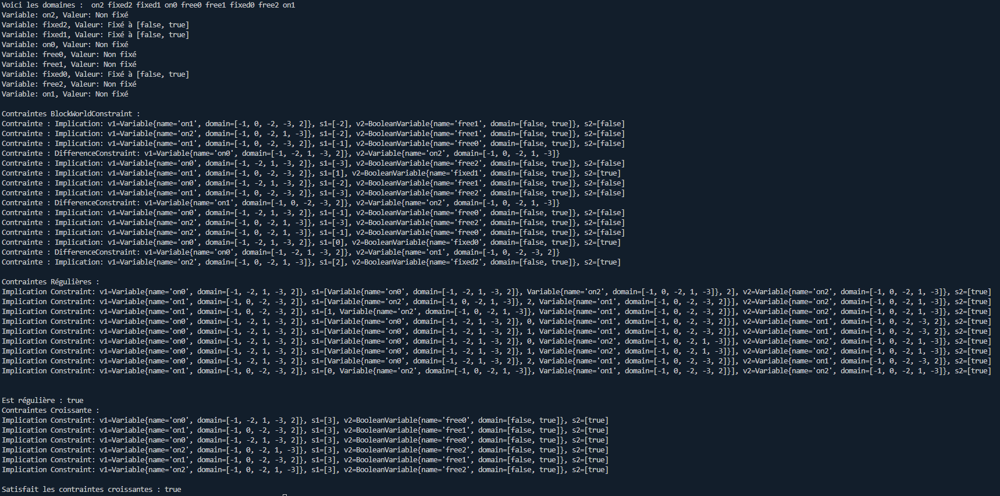

# Blockworld 
Ce projet a été réalisé seul au 1er semestre de 3eme année de licence informatique et n'a pas été finis en raison de manque de temps. Mais également car je n'etais jamais sur de si ce que je faisais était ce qui était attendu (et je n'avais pas osé demander).

### Principe du projet
Le monde des blocs (BlocksWorld) est un domaine de planification en intelligence artificielle
où des blocs doivent être déplacés pour construire des piles. Il offre un cadre simple pour
étudier les approches symboliques de l’intelligence artificielle. Ce problème permet de comparer
différentes théories et algorithmes de résolution. (source : Wikipedia). 

### Ce que ça donne lorsque lancé

### Lancement

Pour compiler tout :
javac -d build src/blocksworld/*.java src/modelling/*.java src/planning/*.java src/heuristique/*.java src/solver/*.java src/main/*.java
Pour executer:
java -cp build Main

Il n'y a pas de partie graphique implémenté c'est pour ça que la librairie n'est pas dans la ligne de commande

### Conclusion
Le projet BlocksWorld a été pour moi très difficile car j’ai eu du mal à comprendre comment
le faire et à savoir si ce que j’ai fait été correct. J’ai essayé de faire le maximum que je pouvais
malgrès ça.
#### Ce dont je ne suis pas sur d’avoir faire correctement
Durant la réalisation du fil rouge je me suis posé des question de si j’avais fait correctement
l’exercice 1 et 2. Car j’avais l’impression de mal faire les choses sans savoir pour autant quoi
changer.   
Je n’arrivais également pas trop a savoir comment il fallait utiliser les class de l’exercice 1
et 2 dans les autres exercices, j’ai essayé de les utiliser au mieux selon ce que j’avais compris.
#### Ce que je n’ai pas réussi a faire ou que je n’ai pas fait
- Faire une 2eme heuristique, ça m’a déjà pris du temps de trouver la première, je n’avais
donc aucune idée de comment en faire une 2eme
- Les class de déplacement ont été très probablement mal faite car je n’arrivais pas trop a
visualiser et comprendre comment faire pour vraiment déplacer de façon correct un blocs
dans le mondes des blocs, et surtout par rapport au pile
- Je trouve ça bizarre que aucun plan ne soit trouvé quand je test mes contrainte avec
un planificateur c’est pour ça que j’en ai fait qu’un car je n’ai pas réussi a comprendre
comment l’utiliser correctement j’ai malgrès tout laissé celui que j’avais essayé de faire.
- Je n’ai pas fait de test avec les librairies fournis
- Je n’ai pas fait la partie 4 et 5 du file rouge par manque de temps et parce que j’avais du
mal a comprendre comment les faire